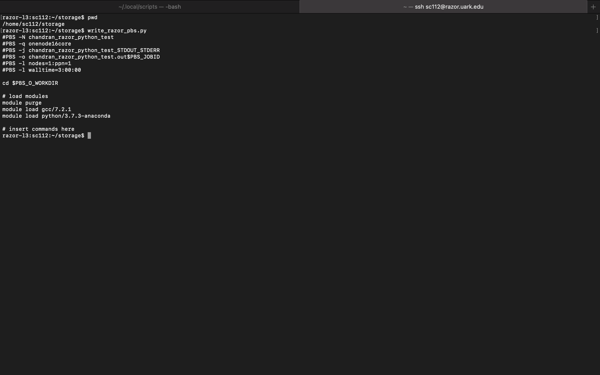

# BIOL5153
Practical Programming for Biologists Course Repository.

## assn03.tgz 
- Zipped tape archive of BLAST program outputs executed on remote server (AHPCC-Razor).
- Has pbs scripts and STDOUT/STDERR files.

## assn04
- Screenshot showing pwd, script command and output of write_razor_pbs.py script.

- write_razor_pbs.py - Python script to run on Razor 
- write_pinnacle_pbs.py - Python script to run on Pinnacle.

## Images
- Has all the images that were added to this repository as part of assignments.

## assn05
- nucleotide_composition.py - Python scipt to find the length of a DNA sequence and to calculate the frequencies of ATGC. 